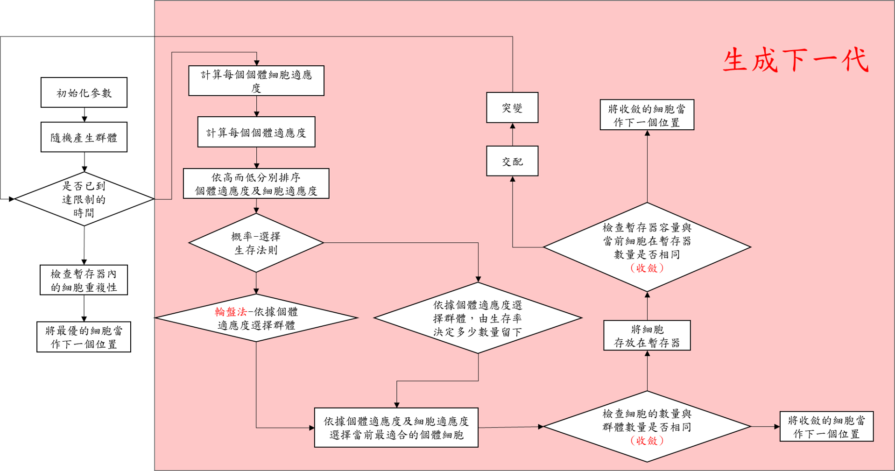
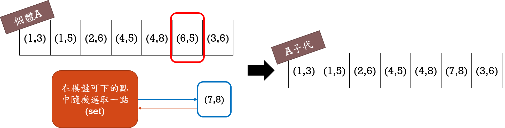

# 超啟發式之基因演算法解五子棋問題
## Super Heuristic Genetic Algorithm for Gomoku Problem

* ### 五子棋簡介
  * 五子棋是一個在二維棋盤上雙方輪流落子的遊戲，在任一方向(橫向、縱向、左斜、右斜)連成五子者獲勝。 
  * 本研究所設計的五子棋並無任何規則限制。 
  * 本研究利用**基因演算法**，建立一個能與人對戰的五子棋程式和機器與機器對戰。 
  
* ### 參數設定
  > 棋盤結構 : 15*15  
  > 編碼方式 : 去邊界後從未下棋的位置隨機選取 
  > 染色體長度 : 7 
  > 生存率 :  0.1 
  > 突變率 : 0.01 
  > 最大群體限制 : 1000 
  > 時間限制 :  5s/10s 

* ### 基本架構
 
 >1. 建立初始的群體 
 >2. 計算適應函數(權重) 
 >3. 選擇基因 (Selection) 
 >4. 交配 (Crossover) 
 >5. 突變 (Mutation) 
 >6. 排序所有適應度的群體 
 >7. 計算目前最優的位置 
 >8. 輸出最優的位置 

* ### 權重值設定 (Set WEIGHT value) 
<table>
    <tr>
        <td align='center'>局面狀態</td>
        <td align='center'>解釋</td>
        <td align='center'>Weight</td>
    </tr>
     <tr>
        <td align='center'>長連</td>
        <td>連成五子</td>
        <td>100000</td>
    </tr>
     <tr>
        <td align='center'>活四</td>
        <td>己方有兩個點可以連成五子</td>
        <td>5000</td>
    </tr>
      <tr>
        <td align='center'>衝四</td>
        <td>己方剩一個點可以連成五子</td>
        <td>1000</td>
    </tr>
      <tr>
        <td align='center'>死四</td>
        <td>己方已不可能形成五的四子</td>
        <td>100</td>
    </tr>
      <tr>
        <td align='center'>活三</td>
        <td>己方再落一子能形成活四的三子</td>
        <td>1000</td>
    </tr>
      <tr>
        <td align='center'>衝三</td>
        <td>己方剩一個點可以連成四子</td>
        <td>200</td>
    </tr>
      <tr>
        <td align='center'>死三</td>
        <td>己方已不可能形成五的三子</td>
        <td>10</td>
    </tr>
      <tr>
        <td align='center'>活二</td>
        <td>己方有兩個點可以形成活三</td>
        <td>50</td>
    </tr>
      <tr>
        <td align='center'>衝二</td>
        <td>己方剩一個點可以連成三子</td>
        <td>5</td>
    </tr>
      <tr>
        <td align='center'>死二</td>
        <td>己方已不可能形成五的二子</td>
        <td>3</td>
    </tr>
</table>

* ### 基因演算法流程圖
 
 
* ### 交配 **Crossover**
 > 隨機抓取兩個父代，如下圖的個體A與個體B，隨機選擇交換的基因位置(AB得同個位置)，並交換其位置並得到子代YZ。
 >

* ### 突變 **Mutation**
  >隨機在棋盤上未下的點選擇一點當作**突變點**，並選擇某個體作為突變的父代，在其父代隨機選擇一個基因位置作為突變的位置，將前面得到的**突變點**取代父代的需突變位置，即可得到突變後的子代。(如下圖)
 >

* ### 結果探討
 >因本研究計算出來的結果是去判斷棋子應落下何處，而非數值，並非能用來當結果作展現，為此我們思考將每世代的適應度來做比較以此當作收斂的結果，一開始，本研究想知道每世代資料是不是都比前世代的資料更加適應這環境，所以將全部資料話去做畫圖，因資料量過於龐大不易看清，所以下圖為本研究取每世代的前十筆資料做適應度的比較。 
 >
 >可以看到第七世代與第八世代值非常接近，已經慢慢收斂了。為了較清楚判別是否收斂，本研究取每世代最佳的適應度來做代表，以此下去畫圖，如下圖五所示，每世代最佳適應度值的比較圖。 
 >
 
